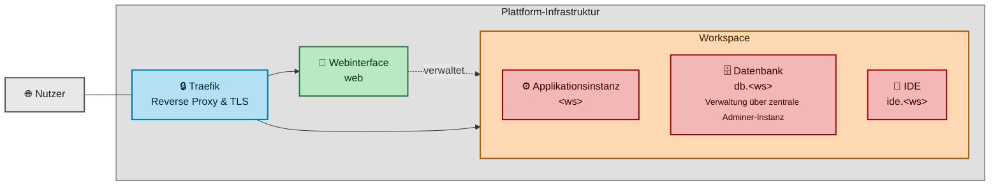

# Case Study: Self-Service-Plattform für Entwickler-Workspaces

**Umfang:** allein umgesetzt, von der Architekturentscheidung bis zum Betrieb  
**Stack:** Docker Compose, Traefik, Python, Node.js/Express, React, XFS-Quotas, Bash

## Ausgangslage

Support-, QA- und Entwicklungs-Anfragen brauchten wiederholt vollständige, voneinander isolierte Instanzen derselben Applikation in unterschiedlichen Versions- und PHP/Datenbank-Kombinationen: für Fehlernachstellung, Modulentwicklung, Kundendemos und Schulungen. Ohne eine solche Plattform hätte das bedeutet, für jede Anfrage manuell Container, DNS und Zertifikate anzufassen, mit entsprechender Wartezeit und Fehleranfälligkeit bei mehreren parallelen Umgebungen. Zudem musste ein einmal nachgestellter Fehler erhalten bleiben, bis der zuständige Entwickler ihn untersuchen konnte, statt beim Übergang zwischen Support und Entwicklung verloren zu gehen oder neu aufgesetzt werden zu müssen.

Die Plattform stellt dafür pro Workspace-Namen eine komplette Kombination aus Applikationsinstanz, Datenbank und browserbasierter IDE bereit, verwaltet über eine zentrale Docker-Compose-Infrastruktur mit einem Python-Verwaltungsskript und einem selbst gebauten Webinterface.

Heute laufen darauf 26 dauerhafte Umgebungen für rund 14 Nutzer aus Support, QA und Entwicklung, dazu bedarfsgesteuerte Schulungsinstanzen: eine Instanz pro Teilnehmer, nach dem Kurs automatisiert abgeräumt.

## Architektur in Grundzügen

Ein Traefik-Reverse-Proxy terminiert TLS per Let's-Encrypt-HTTP-Challenge und routet nach Hostname-Regeln, die direkt aus Docker-Labels erzeugt werden. Jeder Workspace besteht aus drei Containern (Applikationsinstanz, Datenbank, IDE auf Basis von Code-Server, einem Visual-Studio-Code-Fork für den Browser), die über einen gemeinsamen Namen referenziert werden. Ergänzt wird das um zentrale Dienste: Datenbank-Admin-Oberfläche, Mail-Catcher zum Abfangen von Testmails, Zugriffs-Logging sowie das Webinterface selbst, das über einen gemounteten Docker-Socket die eigentliche Container-Steuerung übernimmt.



```yaml
webinterface:
  volumes:
    - /var/run/docker.sock:/var/run/docker.sock:ro
  labels:
    - "traefik.http.routers.webinterface.rule=Host(`web.${DOMAIN}`)"
    - "traefik.http.middlewares.web-auth.basicauth.users=${WEBINTERFACE_AUTH}"
```

Images sind zweistufig aufgebaut: ein PHP/Composer-Basis-Image wird einmal pro Versionskombination gebaut und danach für Applikations- und IDE-Images wiederverwendet, statt jede Kombination komplett neu zu bauen. Ein Python-Skript verwaltet dabei den Zustand der einzelnen Workspaces zentral.

## Fähigkeiten der Plattform

**Deklaratives An- und Abmelden von Workspaces.** Ein Verwaltungsskript legt in einem Aufruf Umgebungsvariablen, Compose-Service-Block und Sichtbarkeits-Eintrag im Webinterface an oder entfernt sie. Beim Entfernen fallen zusätzlich Container, Datenverzeichnis und Docker-Volume weg. Verhindert, dass ein über mehrere Dateien parallel gepflegter Zustand auseinanderläuft oder eine Stelle schlicht vergessen wird, was sich sonst erst als schwer auffindbarer Fehler zeigt.

**Versions-Autodetektion beim Anlegen.** Beim Hinzufügen liest das Skript vorhandene Versions- und Datenbank-Image-Werte aller bestehenden Workspaces, wählt per Semver-Vergleich die höchste bzw. beim Datenbank-Image die häufigste Kombination und schlägt sie interaktiv vor. Andernfalls würden neue Workspaces mit veralteten oder uneinheitlichen Standardversionen starten.

```python
def add_workspace(name, description='', values=None, start=False):
    success = add_to_env(name, description, values)
    success &= add_to_compose_override(name, description)
    success &= add_to_webinterface_config(name)
```

**Layered Image-Builds nach Versions-Kombination.** Ein Build-Skript trennt Basis-Images von Applikations- und IDE-Images und cacht sie nach PHP-/Paketmanager-Version. Eine zentrale Konfigurationsdatei definiert, welche Versions-Kombinationen benötigt werden oder sinnvoll sind, um die Systemanforderungen der Applikation zu erfüllen. Zuvor erforderte jede Versionskombination einen vollständigen Neubau. Zusammen mit einer allgemeinen Vereinfachung des Buildprozesses sank die Build-Zeit dadurch von rund vier auf knapp zwei Minuten.

**Selbstbedienungs-Weboberfläche für Nicht-Admins.** Ein Express-Backend bietet Endpunkte zum Starten/Zurücksetzen von Workspaces sowie zum Wechseln von Applikations- und Datenbank-Image-Version pro Workspace. Ein Reset läuft dabei in rund 30 Sekunden durch, inklusive Warten auf die erste erfolgreiche Antwort der Applikation. Nimmt den Bedarf, solche Wünsche über mich als einzige Ansprechperson für Infrastruktur laufen zu lassen.

```js
async function waitUntilUp(workspaceUrl, timeoutMs) {
  const deadline = Date.now() + timeoutMs;
  while (Date.now() < deadline) {
    const res = await httpGet(workspaceUrl).catch(() => null);
    if (res?.status === 200) return true;
  }
  return false;
}
```

**Versionswechsel ohne Datenverlust.** Applikations- und Datenbank-Image-Version lassen sich pro Workspace austauschen, ohne die bestehende Applikation zu löschen. Damit lässt sich ein Upgrade-Pfad (z. B. ein PHP- oder Versionswechsel) direkt auf echten, bestehenden Daten testen statt nur auf einer frischen Installation.

**Eigenes Verhalten für den Schulungsbereich.** Vor einer Schulung lässt sich festlegen, wie viele Workspaces der Kurs benötigt. Die passende Anzahl wird über das Webinterface angelegt, statt jede Teilnehmer-Instanz einzeln von Hand einzurichten. Zusätzlich rotiert das Zugangspasswort für diesen Bereich automatisch, statt wie bei den übrigen Workspaces dauerhaft gleich zu bleiben.

**In die IDE eingebettete Lifecycle-Kommandos.** Jedes IDE-Image bringt eigene Shell-Befehle für Installation, vollständige Rücksetzung, Vorbereitungsschritte für eine GUI-Installation, Aufbau aus mehreren einzeln geklonten Repositories, Cache-Leerung und Wechsel des aktiven Xdebug-Modus mit. Ohne das müssten Nutzer mehrstufige Abhängigkeits-, Datenbank- und Konfigurationsabläufe jedes Mal von Hand ausführen. Optional lassen sich pro Workspace Konfigurationsdateien eines vorinstallierten CLI-Coding-Assistenten als Volume einhängen, sodass Einstellungen einen Reset überleben.

**Zentraler Mail- und Datenbank-Zugriff über alle Workspaces hinweg.** Ein einzelner Mail-Catcher fängt sämtliche von den Applikationsinstanzen versendeten Mails ab, statt sie an echte Adressen zuzustellen. Mailfunktion und -inhalte lassen sich damit prüfen, ohne dass beim Testen reale Postfächer benutzt werden. Eine zentrale Adminer-Instanz erlaubt direkten Zugriff auf die Datenbank jedes Workspace, sowohl für die direkte Fehlersuche in den Daten der Applikation als auch zum Importieren von Demodaten.

## Betriebliche Absicherung

**Log-Rotation für Container-Logs.** Die Logs der Workspace-Container werden begrenzt und rotiert. Auslöser war ein einzelnes Container-Log, das über Monate ungebremst gewachsen war und dabei die Hostplatte volllaufen ließ.

**Speicherplatz-Kontingente pro Volume.** Ein Skript vergibt XFS-Project-Quotas auf die Datenverzeichnisse aller Workspace-Volumes, entfernt verwaiste Einträge für gelöschte Volumes automatisch und bietet einen Statusbefehl; ein zweites Skript zeigt die aktuelle Auslastung je laufendem Container. Nötig wurde das für alles, was die Log-Rotation nicht abfangen konnte, etwa datenintensive oder Performance-Tests, die ein einzelnes Workspace-Volume unabhängig von den Logs anwachsen ließen.

**Eingabevalidierung gegen Namenskollisionen und Drift.** Workspace-Namen sind aus Gründen der Hostname- und DNS-Kompatibilität auf Kleinbuchstaben und Ziffern beschränkt, Existenzprüfungen verhindern doppeltes Anlegen, und das Entfernen eines Workspaces räumt Container, Volume und Datenverzeichnis in einem Arbeitsgang ab statt Teilzustände zu hinterlassen.

## Gezeigte Fähigkeiten

Docker/Docker Compose (Multi-Container-Orchestrierung, Label-basiertes Routing, Image-Layering zur Build-Zeit-Optimierung), Traefik (Reverse Proxy, automatisiertes TLS), Python (CLI-Tooling für Infrastrukturzustand, Idempotenz-Handling bei generiertem Code), Node.js/Express + React (Self-Service-Weboberfläche für Infrastrukturaktionen), Linux-Ressourcenverwaltung (XFS-Project-Quotas gegen Disk-Erschöpfung), Betriebssicherheit für Multi-Tenant-Umgebungen (Eingabevalidierung, Zustands-Konsistenz über mehrere Konfigurationsdateien hinweg).

---

[← Zurück zur Übersicht](README.md)
